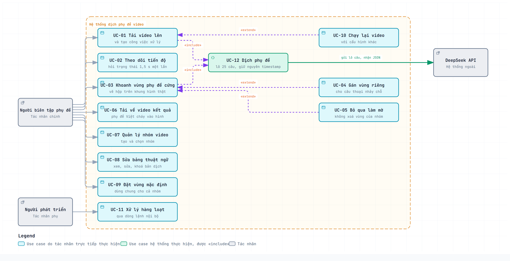

# Tài liệu đặc tả yêu cầu

**Đề tài:** Xây dựng hệ thống web tự động dịch và chèn phụ đề tiếng Việt cho video tiếng Anh, có xử lý che phụ đề cứng

**Nhóm:** 4 thành viên (TV1 nhóm trưởng) · **Tuần 2** — Khảo sát và đặc tả yêu cầu · **Ngày lập:** 16/09/2026

**Tài liệu liên quan:** [Đề cương](DE_CUONG.md) · [Phân công](PHAN_CONG.md) · [Thiết kế hệ thống](superpowers/specs/2026-09-09-video-dich-phu-de-design.md) · [Kế hoạch triển khai](superpowers/plans/2026-09-09-dich-phu-de-video.md)

---

## Mục lục

1. [Giới thiệu](#1-giới-thiệu)
2. [Kết quả khảo sát](#2-kết-quả-khảo-sát)
3. [Yêu cầu chức năng](#3-yêu-cầu-chức-năng)
4. [Yêu cầu phi chức năng](#4-yêu-cầu-phi-chức-năng)
5. [Use case](#5-use-case)
6. [Kế hoạch công việc](#6-kế-hoạch-công-việc)
7. [Phụ lục](#7-phụ-lục)

---

## 1. Giới thiệu

### 1.1 Mục đích tài liệu

Tài liệu này xác định **hệ thống phải làm được những gì** và **làm tốt tới mức nào**, dùng làm căn cứ chung cho cả nhóm khi lập trình và khi nghiệm thu. Mỗi yêu cầu đều kèm tiêu chí chấp nhận đo được, để lúc nghiệm thu không phải tranh luận xem một chức năng đã xong hay chưa.

### 1.2 Phạm vi sản phẩm

Hệ thống là một **ứng dụng web chạy cục bộ**. Người dùng mở trình duyệt, tải lên một video có thoại tiếng Anh, khoanh vùng phụ đề cứng bằng chuột trên khung hình mẫu, và tải về chính video đó với phụ đề tiếng Việt cháy vào hình, đồng thời vệt phụ đề cứng tiếng Anh đã bị làm mờ.

**Trong phạm vi:** tiếp nhận video, lấy phụ đề gốc (tận dụng phụ đề sẵn có hoặc nhận dạng giọng nói), dịch Anh → Việt, quản lý thuật ngữ theo nhóm video, khoanh vùng và làm mờ phụ đề cứng, kết xuất video, theo dõi tiến độ, chạy lại an toàn.

**Ngoài phạm vi:** lồng tiếng TTS, tự dò vùng chữ bằng OCR, giao diện desktop, phụ đề mềm nhúng, đăng nhập và phân quyền, hàng đợi ngoài (Celery/Redis), WebSocket, triển khai lên máy chủ công cộng, xử lý nhiều video song song, vùng mờ tự bám theo chuyển động trong một câu.

### 1.3 Đối tượng người dùng

| Vai trò | Mô tả | Nhu cầu chính |
|---|---|---|
| **Người biên tập phụ đề** | Người dùng chính. Có video tiếng Anh cần phụ đề Việt, không biết lập trình, làm việc hoàn toàn qua trình duyệt | Tải lên → khoanh vùng → tải về, không cần hiểu kỹ thuật bên trong |
| **Người phát triển** | Thành viên nhóm, dùng công cụ dòng lệnh nội bộ để gỡ lỗi và xử lý hàng loạt | Chạy từng bước, kiểm tra file trung gian, chạy nhiều video liên tiếp |

### 1.4 Thuật ngữ

| Thuật ngữ | Giải thích |
|---|---|
| **Câu thoại (cue)** | Một đơn vị phụ đề gồm số thứ tự, mốc bắt đầu, mốc kết thúc và nội dung chữ |
| **Phụ đề cứng (hardsub)** | Phụ đề đã cháy vào pixel của video, không tách ra được bằng phần mềm |
| **Phụ đề mềm / sidecar** | Phụ đề lưu thành file `.srt` riêng hoặc track chữ nhúng trong video, tách ra được |
| **Vùng mờ** | Hình chữ nhật người dùng khoanh để che vệt phụ đề cứng, lưu theo tỉ lệ phần trăm |
| **Nhóm** | Tập hợp video dùng chung bảng thuật ngữ và vùng mờ mặc định (một bộ phim, một kênh) |
| **Bảng thuật ngữ (glossary)** | Danh sách cặp từ gốc → bản dịch, giữ cho tên riêng nhất quán giữa các tập |
| **Công việc** | Một lượt xử lý một video, có mã định danh, trạng thái và tiến độ |
| **Một lần nén** | Video chỉ được giải mã và mã hóa lại đúng một lượt, không nén chồng nhiều lần |

---

## 2. Kết quả khảo sát

### 2.1 Phương pháp

Nhóm khảo sát **4 hệ thống tương tự** đang hoạt động trên thị trường, chia làm hai nhóm: công cụ tạo và dịch phụ đề, và công cụ xóa phụ đề cứng. Với mỗi hệ thống, nhóm đối chiếu theo 8 tiêu chí rút ra từ bài toán của đề tài.

Nguồn dữ liệu là trang chủ và trang giá **chính thức** của từng sản phẩm, truy cập **ngày 16/09/2026**. Ảnh chụp màn hình làm bằng chứng lưu tại `docs/khaosat/`:

| Ảnh | Nội dung |
|---|---|
| `subtitle-edit.png` | Trang chủ Subtitle Edit — nêu rõ miễn phí, mã nguồn mở GPL, có Whisper và 300+ định dạng |
| `veed-pricing.png` · `veed-pricing-monthly.png` | Bảng giá VEED bốn gói, kèm dòng tính năng dịch của từng gói |
| `kapwing-pricing.png` · `kapwing-pricing-chitiet.png` | Bảng giá Kapwing, kèm hạn mức phụ đề và dấu chìm của gói miễn phí |
| `media-io-subtitle-remover.png` | Trang công cụ xóa phụ đề của Media.io |

> **Lưu ý về độ tin cậy số liệu.** Lượt khảo sát đầu dùng bài viết của bên thứ ba và cho ra giá VEED sai lệch đáng kể. Số trong bảng dưới đây đã được đối chiếu lại với trang giá chính thức và khớp với ảnh chụp. Giá dịch vụ thay đổi thường xuyên — chụp lại và kiểm số ngay trước khi nộp.

### 2.2 Bảng so sánh các hệ thống tương tự

| Tiêu chí | Subtitle Edit | VEED.IO | Kapwing | GhostCut / Media.io | **Hệ thống đề xuất** |
|---|---|---|---|---|---|
| **Loại** | Ứng dụng desktop, mã nguồn mở | Web, thương mại | Web, thương mại | Web, thương mại | Web chạy cục bộ |
| **Nhận dạng giọng nói** | Có (Whisper, chạy máy người dùng) | Có (125+ ngôn ngữ) | Có (100+ ngôn ngữ) | Không phải trọng tâm | Có (Whisper `large-v3`) |
| **Tận dụng phụ đề sẵn có** | Có, đọc 300+ định dạng | Không rõ | Không rõ | Không | **Có, ưu tiên trước khi nhận dạng** |
| **Dịch tự động** | Có (Google Translate) | Có (bản trả phí) | Có (100+ ngôn ngữ) | Không | Có (mô hình ngôn ngữ lớn) |
| **Thuật ngữ nhất quán nhiều tập** | Không có cơ chế riêng | Không | Không | Không | **Có, bảng thuật ngữ theo nhóm** |
| **Xóa/che phụ đề cứng** | Không | Không | Không | Có (AI inpainting) | **Có, làm mờ vùng người dùng khoanh** |
| **Cháy phụ đề + che phụ đề cứng cùng lúc** | Không | Không | Không | Không | **Có, trong một lần nén** |
| **Chi phí người dùng cuối** | Miễn phí hoàn toàn | Creator 10 USD · **Pro 21 USD** (gói thấp nhất có dịch) · Studio 35 USD — mỗi người mỗi tháng, trả theo năm | Free: 10 phút phụ đề, có dấu chìm, video ≤ 4 phút, 720p · Pro 16 USD/tháng trả năm (24 USD trả tháng) | Trả phí theo lượt | Chỉ trả tiền API dịch theo lượng dùng thật |
| **Dữ liệu rời khỏi máy** | Không (trừ khi gọi dịch) | Có, tải video lên máy chủ | Có, tải video lên máy chủ | Có, tải video lên máy chủ | **Không, chỉ gửi văn bản phụ đề đi dịch** |

### 2.3 Nhận xét và khoảng trống tìm được

**Nhận xét 1 — Không công cụ nào làm cả hai việc trong một lượt.** Các công cụ dịch phụ đề (Subtitle Edit, VEED, Kapwing) không xử lý phụ đề cứng; các công cụ xóa phụ đề cứng (GhostCut, Media.io) không dịch. Người dùng muốn cả hai phải chạy qua hai phần mềm, tức là **video bị nén lại hai lần**, mỗi lần đều mất chất lượng.

**Nhận xét 2 — Không công cụ nào giữ thuật ngữ nhất quán giữa các tập.** Với phim bộ hay kênh nhiều tập, tên riêng dịch ở tập 1 không được ghi nhớ sang tập 24. Người dùng phải tự dò và sửa tay, hoặc chấp nhận mỗi tập một cách gọi khác nhau.

**Nhận xét 3 — Các công cụ web đều yêu cầu tải video lên máy chủ.** Với video chưa phát hành hoặc có bản quyền, đây là rào cản thật. Chi phí cũng là chuyện phải tính: chức năng dịch của VEED chỉ có từ gói Pro 21 USD mỗi người mỗi tháng, còn gói miễn phí của Kapwing chỉ cho 10 phút phụ đề, video tối đa 4 phút, chất lượng 720p và có dấu chìm — không dùng được cho một tập phim.

**Nhận xét 4 — Xóa phụ đề cứng không có lời giải hoàn hảo.** Khi chữ đã cháy vào pixel thì không công cụ nào phục hồi được phần hình bị che. Các công cụ AI inpainting cố dựng lại nền và thường để lại vệt nhòe. Hệ thống của nhóm chọn cách trung thực hơn: **làm mờ vùng đó rồi đặt phụ đề Việt đè lên**, che gần hết vệt cũ mà không giả vờ phục hồi được thứ không còn.

**Khoảng trống hệ thống nhắm tới:** một công cụ chạy cục bộ, làm được cả dịch lẫn che phụ đề cứng trong **một lần nén duy nhất**, và nhớ được thuật ngữ giữa các tập của cùng một bộ phim.

### 2.4 Biên bản khảo sát

> Mẫu để nhóm điền sau buổi khảo sát. Mỗi thành viên khảo sát ít nhất một hệ thống.

| Mục | Nội dung |
|---|---|
| **Thời gian** | _(điền)_ |
| **Hình thức** | Khảo sát trực tuyến trang chủ, trang giá và tài liệu chính thức |
| **Thành viên tham gia** | _(điền)_ |
| **Hệ thống khảo sát** | Subtitle Edit (TV_), VEED.IO (TV_), Kapwing (TV_), GhostCut/Media.io (TV_) |
| **Bằng chứng thu thập** | Ảnh chụp màn hình lưu tại `docs/khaosat/` |
| **Kết luận thống nhất** | Bốn nhận xét tại §2.3; chốt phạm vi sản phẩm tại §1.2 |
| **Người ghi biên bản** | _(điền)_ |

---

## 3. Yêu cầu chức năng

**Quy ước đọc bảng.** Mỗi yêu cầu có mã `FR-xx`, phát biểu ở dạng **kiểm chứng được** — nêu rõ điều kiện đầu vào, hành vi mong đợi và cách xác minh. Cột **Ưu tiên** theo MoSCoW: `M` bắt buộc có, `S` nên có, `C` có thì tốt.

### 3.1 Nhóm A — Tiếp nhận video

**Mục đích:** đưa video vào hệ thống một cách an toàn, từ chối sớm những file không xử lý được để người dùng không phải chờ vô ích.

| Mã | Yêu cầu | Tiêu chí chấp nhận | Ưu tiên |
|---|---|---|---|
| **FR-01** | Người dùng tải lên một file video qua trình duyệt | Chọn file `.mp4`/`.mkv`/`.mov`/`.webm`/`.avi`/`.ts` và bấm bắt đầu thì hệ thống trả về mã công việc trong vòng 5 giây với video dưới 100 MB | M |
| **FR-02** | Hệ thống từ chối file không hợp lệ kèm thông báo nêu rõ lý do | File sai định dạng, file rỗng, file vượt 4 GiB, hoặc file không đọc được bằng `ffprobe` đều bị từ chối với mã lỗi 400 và một câu thông báo tiếng Việt; **không** có file rác nào còn lại trong thư mục làm việc | M |
| **FR-03** | Người dùng chọn tùy chọn xử lý trước khi bắt đầu | Giao diện cho chọn: tên nhóm, ngôn ngữ nguồn, model nhận dạng, chế độ làm mờ (tự động/bật/tắt), hệ số cỡ chữ, bật/tắt cắt khoảng lặng, bật/tắt tách giọng hát. Mọi tùy chọn đều có giá trị mặc định dùng được ngay mà không cần chỉnh | M |

### 3.2 Nhóm B — Lấy phụ đề gốc

**Mục đích:** có được phụ đề tiếng Anh với chi phí thấp nhất. Nhận dạng giọng nói tốn vài phút và cần GPU, nên chỉ chạy khi thật sự không còn cách nào rẻ hơn.

| Mã | Yêu cầu | Tiêu chí chấp nhận | Ưu tiên |
|---|---|---|---|
| **FR-04** | Hệ thống ưu tiên phụ đề có sẵn trước khi nhận dạng | Video có file `.srt` đặt cạnh hoặc có track phụ đề **dạng chữ** nhúng sẵn thì hệ thống dùng luôn và **không** chạy nhận dạng. Xác minh: nhật ký ghi bước nhận dạng là `bỏ qua`, thời gian xử lý giảm rõ rệt so với cùng video đã gỡ phụ đề | M |
| **FR-05** | Hệ thống nhận dạng lời thoại khi không có phụ đề sẵn | Video không có nguồn phụ đề nào thì hệ thống tách âm thanh và nhận dạng bằng Whisper, sinh ra file phụ đề gốc có số câu thoại lớn hơn 0 và mốc thời gian tăng dần | M |
| **FR-06** | Hệ thống tự chuyển sang CPU khi GPU không dùng được | Khi lỗi thuộc nhóm thiếu thư viện CUDA/cuDNN hoặc hết bộ nhớ GPU, hệ thống thử lại **đúng một lần** trên CPU và hoàn thành. Lỗi khác loại (model không tồn tại, âm thanh hỏng) phải báo ra ngay, **không** thử lại | M |
| **FR-07** | Hệ thống cảnh báo khi kết quả nhận dạng bất thường | Tổng thời lượng phụ đề nhận dạng được phủ dưới 25% thời lượng video thì công việc kết thúc ở trạng thái **suy giảm** kèm thông báo gợi ý tắt chế độ cắt khoảng lặng — **không** báo hoàn thành bình thường | S |

### 3.3 Nhóm C — Dịch phụ đề

**Mục đích:** dịch sang tiếng Việt mà không làm hỏng cấu trúc thời gian của phụ đề. Một câu bị gộp hay tách sẽ làm lệch toàn bộ phần phía sau.

| Mã | Yêu cầu | Tiêu chí chấp nhận | Ưu tiên |
|---|---|---|---|
| **FR-08** | Mỗi câu thoại nguồn ứng đúng một câu thoại kết quả | File phụ đề Việt có **đúng bằng** số câu của file gốc, và mốc bắt đầu/kết thúc của từng câu **giống hệt** bản gốc. Xác minh bằng test tự động so từng cặp câu | M |
| **FR-09** | Hệ thống xử lý được phản hồi hỏng một phần mà không bỏ cả lô | Khi một phần phản hồi thiếu hoặc sai cấu trúc, hệ thống giữ những câu dịch tốt và gọi lại **đúng một lần** cho từng câu hỏng. Cả lô hỏng thì chia đôi tối đa hai tầng rồi mới gọi lẻ từng câu | M |
| **FR-10** | Câu không dịch được vẫn giữ nguyên bản gốc và được báo rõ | Sau khi thử hết các bước cứu, câu vẫn hỏng thì giữ nguyên văn bản tiếng Anh; công việc kết thúc ở trạng thái **suy giảm** kèm số câu bị giữ nguyên. Công cụ dòng lệnh trả mã thoát khác 0 | M |
| **FR-11** | Lỗi xác thực hoặc lỗi mạng dừng công việc thay vì thử lại vô ích | Sai khóa API hoặc mất mạng thì hệ thống dừng video đó với thông báo lỗi rõ ràng, **không** dùng cơ chế chia lô để thử lại, và **không** ghi ra file dịch dở | M |

### 3.4 Nhóm D — Thuật ngữ và nhóm video

**Mục đích:** giữ tên riêng nhất quán xuyên suốt nhiều tập — đây là khoảng trống tìm được ở §2.3.

| Mã | Yêu cầu | Tiêu chí chấp nhận | Ưu tiên |
|---|---|---|---|
| **FR-12** | Người dùng tạo và chọn nhóm cho video | Nhập tên nhóm khi tải video lên; nhóm chưa tồn tại thì được tạo mới. Trang quản lý liệt kê được các nhóm đã có | M |
| **FR-13** | Thuật ngữ học được ở video trước áp dụng cho video sau cùng nhóm | Dịch tập 1 sinh ra cặp thuật ngữ mới; dịch tập 2 cùng nhóm thì cặp đó xuất hiện trong bản dịch với **cùng một cách dịch**. Xác minh bằng phép thử nhân quả: đổi bản dịch trong bảng thuật ngữ rồi chạy lại tập 2, kết quả phải đổi theo | M |
| **FR-14** | Người dùng xem, sửa và khóa bản dịch của một thuật ngữ | Trang quản lý cho sửa bản dịch và bật cờ khóa. Thuật ngữ đã khóa **không bị** máy ghi đè ở những lần dịch sau; chỉ lệnh sửa của người dùng mới thay được | M |
| **FR-15** | Việc ghi thuật ngữ không bị đếm trùng khi chạy lại | Chạy lại cùng một video đã dịch xong thì số lần quan sát của mỗi thuật ngữ **không tăng thêm**. Xác minh bằng test đọc lại cơ sở dữ liệu sau hai lượt chạy | S |

### 3.5 Nhóm E — Vùng mờ phụ đề cứng

**Mục đích:** để người dùng chỉ đúng chỗ cần che. Hệ thống không tự dò bằng OCR — người nhìn vẫn chính xác hơn máy trong việc này, và không có gì để dò khi video không có phụ đề cứng.

| Mã | Yêu cầu | Tiêu chí chấp nhận | Ưu tiên |
|---|---|---|---|
| **FR-16** | Hệ thống trích một khung hình cho **mỗi** câu thoại để người dùng xem | Video có N câu thoại thì có đúng N ảnh khung được sinh ra, mỗi ảnh lấy tại thời điểm câu đó xuất hiện. Không lấy mẫu thưa, vì câu phụ đề nhảy chỗ chính là câu cần nhìn nhất | M |
| **FR-17** | Người dùng vẽ, chỉnh và xóa vùng mờ bằng chuột trên khung hình | Kéo trong vùng trống tạo hộp mới; kéo cạnh hoặc góc chỉnh kích thước; kéo giữa hộp dời vị trí; rút hộp về gần bằng không là xóa. Hộp **giữ nguyên** khi chuyển sang khung khác, để người dùng so được câu nào cao nhất | M |
| **FR-18** | Người dùng gán vùng riêng cho câu thoại có phụ đề nhảy chỗ | Chọn chế độ riêng, vẽ vùng mới trên khung của câu đó, rồi áp cho một dải câu liền kề. Vùng chung của các câu còn lại **không đổi**; câu có vùng riêng được đánh dấu trên giao diện | S |
| **FR-19** | Công việc **chờ** người dùng vẽ hộp thay vì báo lỗi | Video chưa có vùng mờ thì công việc dừng ở trạng thái chờ ngay **sau bước nhận dạng và trước bước dịch**. Người dùng gửi hộp lên thì công việc chạy tiếp từ bước dịch. Bỏ cuộc ở màn này thì **chưa tốn** một đồng tiền API nào | M |
| **FR-20** | Mọi vùng mờ đều qua cùng một bộ kiểm tra hình học | Vùng phải có 4 số hữu hạn, `0 ≤ x,y < 1`, `w,h > 0`, `x+w ≤ 1`, `y+h ≤ 1`, quy ra pixel phải chẵn, tối thiểu 2×2 và nằm trọn trong ảnh. Cùng bộ kiểm tra này áp cho giao diện web, dòng lệnh, file trên đĩa và cơ sở dữ liệu | M |
| **FR-21** | Người dùng đặt vùng mờ mặc định cho cả nhóm | Tích ô lưu làm mặc định thì vùng chính được ghi vào nhóm và dùng làm điểm khởi đầu cho video sau. Vùng vẽ riêng của một video luôn **được ưu tiên hơn** vùng mặc định của nhóm | S |

### 3.6 Nhóm F — Kết xuất video

**Mục đích:** tạo ra sản phẩm cuối mà không làm hỏng chất lượng gốc.

| Mã | Yêu cầu | Tiêu chí chấp nhận | Ưu tiên |
|---|---|---|---|
| **FR-22** | Hệ thống làm mờ vùng phụ đề cứng và cháy phụ đề Việt trong **một lần nén** | Toàn bộ thao tác nằm trong một lệnh `ffmpeg` duy nhất. Xác minh: đếm số lần gọi `ffmpeg` ở bước kết xuất bằng đúng 1; video ra có cùng thời lượng và độ phân giải với video vào | M |
| **FR-23** | Âm thanh gốc được giữ nguyên, không mã hóa lại | Luồng âm thanh sao chép nguyên vẹn. Xác minh bằng `ffprobe`: codec và số kênh của video ra trùng video vào | M |
| **FR-24** | Vùng mờ chỉ bật trong khoảng có thoại | Vùng mờ bật trong khoảng thời gian của các câu được gán cho nó, nới thêm ±0.4 giây mỗi phía; các khoảng gần nhau được gộp lại. Xác minh bằng ảnh chụp tại thời điểm có thoại và không có thoại | M |
| **FR-25** | Cỡ chữ và lề dưới của phụ đề Việt bám theo vùng mờ chính | Cỡ chữ suy ra từ chiều cao vùng mờ nhân hệ số người dùng đặt, để chữ Việt che gần hết vệt mờ. Nhiều vùng thì lấy vùng áp cho mọi câu, hoặc vùng phủ nhiều câu nhất | S |
| **FR-26** | Hệ thống kiểm tra file kết quả trước khi coi là hoàn tất | Sau khi kết xuất, hệ thống hỏi `ffprobe` xem file ra có luồng video thật hay không — kích thước file không được coi là bằng chứng. Ghi đè file kết quả cũ chỉ xảy ra sau khi kiểm xong | M |

### 3.7 Nhóm G — Công việc và tiến độ

**Mục đích:** đưa việc chạy vài phút lên được môi trường web, nơi một request HTTP không thể chờ lâu như vậy.

| Mã | Yêu cầu | Tiêu chí chấp nhận | Ưu tiên |
|---|---|---|---|
| **FR-27** | Việc xử lý chạy nền, không chặn giao diện | Yêu cầu tải lên trả về ngay mã công việc; giao diện vẫn thao tác được trong lúc xử lý chạy | M |
| **FR-28** | Người dùng theo dõi được bước hiện tại và phần trăm tiến độ | Giao diện hỏi lại trạng thái theo chu kỳ khoảng 1.5 giây và hiển thị tên bước cùng thanh tiến độ. Tiến độ **không** được nhảy lùi khi công việc chờ vẽ hộp rồi chạy tiếp | M |
| **FR-29** | Hệ thống từ chối xử lý song song trên cùng một video | Công việc thứ hai trên cùng một video bị từ chối với mã 409 kèm thông báo rõ, thay vì chạy chồng và làm hỏng file trung gian | M |
| **FR-30** | Mọi kết cục của công việc nền đều được ghi lại | Thành công, lỗi, hay chờ vẽ hộp đều được ghi vào trạng thái công việc. **Không** có công việc nào kẹt vĩnh viễn ở trạng thái đang chạy sau khi tiến trình xử lý đã kết thúc | M |
| **FR-31** | Người dùng tải về video kết quả từ trình duyệt | Công việc hoàn tất thì nút tải về hoạt động và trả đúng file video đã xử lý | M |

### 3.8 Nhóm H — Chạy lại an toàn

**Mục đích:** chỉnh một chi tiết nhỏ không được bắt người dùng trả lại toàn bộ thời gian GPU và tiền API.

| Mã | Yêu cầu | Tiêu chí chấp nhận | Ưu tiên |
|---|---|---|---|
| **FR-32** | Đổi cấu hình chỉ làm tính lại những bước bị ảnh hưởng | Đổi vùng mờ hoặc cỡ chữ rồi chạy lại thì hệ thống **không** gọi lại nhận dạng và **không** gọi lại API dịch. Xác minh bằng nhật ký: hai bước đó ghi là dùng lại kết quả cũ, số token tiêu thụ bằng 0 | M |
| **FR-33** | Thay nội dung video tại cùng đường dẫn vẫn bị phát hiện | Ghi đè một video khác lên cùng tên file rồi chạy lại thì mọi bước phụ thuộc đều được làm mới, vì chữ ký tính theo **nội dung** file chứ không theo đường dẫn | M |
| **FR-34** | Ngắt giữa chừng không tạo file dở bị hiểu nhầm là hoàn tất | Dừng tiến trình giữa một bước rồi chạy lại thì bước đó được làm lại từ đầu, và kết quả tốt của lần chạy trước **không** bị xóa mất | M |
| **FR-35** | Bản dịch người dùng sửa tay được giữ lại | Sửa tay file phụ đề Việt rồi chạy lại: nếu vẫn đủ số câu và đúng mốc thời gian thì bản sửa được giữ nguyên, không bị ghi đè bằng bản máy dịch | S |

### 3.9 Nhóm I — Công cụ dòng lệnh nội bộ

**Mục đích:** phục vụ nhóm phát triển gỡ lỗi và chạy hàng loạt. **Không phải sản phẩm giao cho người dùng cuối.**

| Mã | Yêu cầu | Tiêu chí chấp nhận | Ưu tiên |
|---|---|---|---|
| **FR-36** | Dòng lệnh và giao diện web cho **cùng một kết quả** | Chạy cùng một video với cùng tùy chọn qua hai đường vào thì sinh ra file kết quả giống nhau. Xác minh bằng test tự động so sánh hai lượt chạy | M |
| **FR-37** | Chế độ hàng loạt xử lý cả một thư mục theo thứ tự | Các video chạy lần lượt để thuật ngữ tích lũy từ video trước sang video sau; mỗi video sinh file kết quả riêng. Hai video trùng tên file đích thì bị từ chối **trước khi ghi bất cứ thứ gì** | S |
| **FR-38** | Mã thoát phản ánh đúng kết quả | `0` khi tất cả thành công; `1` khi có lỗi, có câu giữ nguyên bản gốc, hoặc còn video chờ vẽ hộp; `130` khi người dùng nhấn dừng | S |

**Tổng cộng: 38 yêu cầu chức năng** — 28 bắt buộc (M), 10 nên có (S).

---

## 4. Yêu cầu phi chức năng

| Mã | Nhóm | Yêu cầu | Tiêu chí chấp nhận |
|---|---|---|---|
| **NFR-01** | Hiệu năng | Nhận dạng giọng nói hoàn thành trong thời gian chấp nhận được | Với GPU NVIDIA: không quá 0.5× thời lượng video. Không có GPU, chạy CPU: không quá 2.5× thời lượng video. Đo trên video mẫu 2 phút của nhóm, ghi số thực đo vào báo cáo |
| **NFR-02** | Hiệu năng | Trích khung hình không làm nghẽn giao diện | Thời gian trích trung bình dưới 0.3 giây mỗi khung ở độ phân giải 640×360; ảnh tải lười nên vài chục khung vẫn cuộn mượt |
| **NFR-03** | Hiệu năng | Giao diện phản hồi ngay với thao tác của người dùng | Vẽ và kéo hộp trên canvas không có độ trễ nhìn thấy được; yêu cầu tải lên trả về mã công việc dưới 5 giây với video dưới 100 MB |
| **NFR-04** | Chất lượng đầu ra | Video kết quả không bị giảm chất lượng do nén chồng | Chỉ đúng một lần mã hóa lại; thời lượng, độ phân giải và luồng âm thanh giữ nguyên so với bản gốc |
| **NFR-05** | Độ tin cậy | Mọi lần ghi file đều nguyên vẹn | Ghi ra file tạm cùng thư mục, đóng, kiểm tra, rồi mới thay thế file đích. Mất điện giữa chừng chỉ làm mất cache, không sinh file hỏng |
| **NFR-06** | Độ tin cậy | Một video chỉ được một tiến trình xử lý tại một thời điểm | Khóa theo thư mục làm việc; tiến trình thứ hai bị từ chối. Khóa sót sau khi máy treo **không** tự động bị coi là đã chết — người dùng xác minh rồi xóa tay |
| **NFR-07** | Bảo mật, riêng tư | Video không rời khỏi máy người dùng | Chỉ **văn bản phụ đề** được gửi đến dịch vụ dịch; file video được xử lý hoàn toàn cục bộ. Khóa API đọc từ file cấu hình môi trường, không ghi vào mã nguồn và không đưa lên kho mã |
| **NFR-08** | Bảo mật | Dữ liệu vào từ bên ngoài đều được kiểm tại biên | Tên file tải lên chỉ lấy phần tên, loại bỏ đường dẫn; giới hạn kích thước 4 GiB kiểm **trong lúc** đọc; thông báo lỗi không tiết lộ đường dẫn thật trên máy chủ |
| **NFR-09** | Khả dụng | Giao diện dùng được trên nhiều khổ màn hình | Bốn màn hiển thị đúng ở chiều rộng 360px, 768px và 1440px, có ảnh chụp làm bằng chứng |
| **NFR-10** | Khả dụng | Thông báo lỗi bằng tiếng Việt và nêu được cách xử lý | Mỗi thông báo lỗi nói rõ chuyện gì xảy ra và người dùng nên làm gì tiếp theo |
| **NFR-11** | Khả dụng | Giao diện dùng được khi không có đồ họa 3D | Phần trang trí bằng đồ họa 3D tắt được và **không** phải điều kiện để các chức năng chính hoạt động; tôn trọng thiết lập giảm chuyển động của hệ điều hành |
| **NFR-12** | Khả bảo trì | Kiến trúc phụ thuộc một chiều | Các module xử lý không gọi cơ sở dữ liệu và không biết đến HTTP. Tầng web chỉ nhận yêu cầu, kiểm tra, gọi lớp điều phối rồi trả kết quả — **không** gọi `ffmpeg`, không nạp model |
| **NFR-13** | Khả bảo trì | Một logic chỉ được cài đặt ở một chỗ | Kiểm tra hình học vùng mờ, chọn vùng chính, và toàn bộ luồng xử lý đều dùng chung một cài đặt cho cả web lẫn dòng lệnh |
| **NFR-14** | Khả kiểm thử | Bộ kiểm thử chính chạy được ở máy bất kỳ | Chạy được mà **không** cần mạng, GPU, khóa API, cổng mạng hay màn hình. Thời gian chạy dưới 60 giây |
| **NFR-15** | Tương thích | Môi trường chạy xác định rõ | Python 3.12; `ffmpeg` 6 trở lên có sẵn các bộ lọc cần dùng; một trình duyệt hiện đại. Cài lại theo tài liệu hướng dẫn phải chạy được — có thành viên khác kiểm chứng |
| **NFR-16** | Ràng buộc | Không dùng thành phần ngoài phạm vi đã chốt | Không thêm hàng đợi ngoài, không WebSocket, không ORM, không framework kiểm thử, không đăng nhập. Mọi bổ sung phải được cả nhóm thống nhất trước |

**Tổng cộng: 16 yêu cầu phi chức năng.**

---

## 5. Use case

### 5.1 Tác nhân

| Tác nhân | Loại | Mô tả |
|---|---|---|
| **Người biên tập phụ đề** | Chính | Người dùng cuối, thao tác hoàn toàn qua trình duyệt |
| **Người phát triển** | Phụ | Thành viên nhóm, dùng công cụ dòng lệnh để gỡ lỗi và chạy hàng loạt |
| **Dịch vụ dịch thuật** | Hệ thống ngoài | Mô hình ngôn ngữ lớn nhận văn bản phụ đề và trả bản dịch |

### 5.2 Sơ đồ use case

Bản tương tác có thể mở bằng trình duyệt: [usecase.html](usecase.html)

### 5.3 Danh sách use case

| Mã | Tên | Tác nhân | Yêu cầu liên quan |
|---|---|---|---|
| **UC-01** | Tải video lên và tạo công việc | Người biên tập | FR-01, FR-02, FR-03 |
| **UC-02** | Theo dõi tiến độ xử lý | Người biên tập | FR-27, FR-28 |
| **UC-03** | Khoanh vùng phụ đề cứng | Người biên tập | FR-16, FR-17, FR-19, FR-20 |
| **UC-04** | Gán vùng riêng cho câu thoại nhảy chỗ | Người biên tập | FR-18 |
| **UC-05** | Bỏ qua bước làm mờ | Người biên tập | FR-19 |
| **UC-06** | Tải về video kết quả | Người biên tập | FR-31 |
| **UC-07** | Quản lý nhóm video | Người biên tập | FR-12 |
| **UC-08** | Xem và sửa bảng thuật ngữ | Người biên tập | FR-13, FR-14 |
| **UC-09** | Đặt vùng mờ mặc định cho nhóm | Người biên tập | FR-21 |
| **UC-10** | Chạy lại video với cấu hình khác | Người biên tập | FR-32, FR-33 |
| **UC-11** | Xử lý hàng loạt qua dòng lệnh | Người phát triển | FR-36, FR-37, FR-38 |

### 5.4 Đặc tả use case chính

#### UC-01 — Tải video lên và tạo công việc

| Mục | Nội dung |
|---|---|
| **Tác nhân** | Người biên tập phụ đề |
| **Mục tiêu** | Đưa video vào hệ thống và bắt đầu xử lý |
| **Điều kiện trước** | Máy chủ đang chạy; người dùng có file video thoại tiếng Anh |
| **Điều kiện sau** | Một công việc được tạo với trạng thái chờ, xử lý nền bắt đầu |
| **Luồng chính** | 1. Người dùng mở màn Tải lên 2. Chọn file video từ máy 3. Nhập tên nhóm và chỉnh tùy chọn nếu muốn 4. Bấm Bắt đầu 5. Hệ thống kiểm tra định dạng, kích thước và tính đọc được của file 6. Hệ thống tạo công việc, trả mã và chuyển sang màn Tiến độ |
| **Luồng thay thế** | **5a.** File sai định dạng, rỗng, vượt 4 GiB hoặc không đọc được → hệ thống báo lỗi nêu rõ lý do, xóa file tạm, người dùng chọn lại **5b.** Video này đang được xử lý bởi một tiến trình khác → hệ thống từ chối kèm thông báo, người dùng đợi tiến trình cũ xong |

#### UC-03 — Khoanh vùng phụ đề cứng

| Mục | Nội dung |
|---|---|
| **Tác nhân** | Người biên tập phụ đề |
| **Mục tiêu** | Chỉ cho hệ thống biết vệt phụ đề cứng nằm ở đâu trên khung hình |
| **Điều kiện trước** | Công việc đã qua bước lấy phụ đề gốc và đang ở trạng thái chờ vẽ hộp |
| **Điều kiện sau** | Vùng mờ được lưu; công việc chạy tiếp từ bước dịch |
| **Luồng chính** | 1. Hệ thống chuyển sang màn Vùng làm mờ và hiển thị khung hình của câu thoại đầu tiên 2. Người dùng chuyển qua lại vài khung để tìm câu phụ đề cao nhất 3. Kéo chuột trên khung để vẽ hộp bao lấy vệt phụ đề cứng 4. Kéo cạnh hoặc góc để chỉnh cho khít 5. Bấm gửi 6. Hệ thống kiểm tra hình học của hộp và lưu lại 7. Công việc chạy tiếp từ bước dịch |
| **Luồng thay thế** | **4a.** Người dùng muốn xóa hộp → rút hộp về gần bằng không **4b.** Câu có phụ đề nhảy chỗ → chuyển sang UC-04 **5a.** Người dùng tích ô đặt làm mặc định cho nhóm → hệ thống lưu thêm vùng chính vào nhóm **6a.** Hộp không hợp lệ (vượt biên, quá nhỏ sau khi quy ra pixel) → hệ thống báo lỗi, người dùng vẽ lại **\*a.** Người dùng bấm Bỏ qua → chuyển sang UC-05, không làm mờ nhưng **không** xóa vùng mặc định của nhóm |
| **Ghi chú** | Bước này nằm **trước** bước dịch. Người dùng bỏ cuộc ở đây thì chưa phát sinh chi phí API nào |

#### UC-08 — Xem và sửa bảng thuật ngữ

| Mục | Nội dung |
|---|---|
| **Tác nhân** | Người biên tập phụ đề |
| **Mục tiêu** | Sửa cách dịch một tên riêng và giữ nó cố định cho các tập sau |
| **Điều kiện trước** | Nhóm đã tồn tại và đã có ít nhất một video được dịch |
| **Điều kiện sau** | Bản dịch mới được lưu; những lần dịch sau dùng bản này |
| **Luồng chính** | 1. Người dùng mở màn Nhóm & thuật ngữ 2. Chọn nhóm cần xem 3. Hệ thống hiển thị danh sách cặp từ gốc → bản dịch 4. Người dùng sửa bản dịch của một thuật ngữ 5. Bật cờ khóa để máy không tự sửa lại 6. Lưu |
| **Luồng thay thế** | **4a.** Người dùng thêm thuật ngữ mới chưa từng xuất hiện → hệ thống ghi nhận và áp dụng từ lần dịch sau |
| **Quy tắc nghiệp vụ** | Thuật ngữ đã khóa chỉ thay được bằng lệnh sửa của người dùng. Máy học từ mới không được ghi đè lên bản đã khóa |

---

## 6. Kế hoạch công việc

### 6.1 Nguyên tắc sắp xếp

Kế hoạch sắp theo **thứ tự phụ thuộc kỹ thuật**, không theo lịch cố định: việc nào đủ đầu vào thì bắt đầu ngay, việc nào chưa đủ thì chưa khởi động. Mỗi giai đoạn là một **cổng** chỉ mở khi điều kiện ra đã đạt. Trong cùng một giai đoạn, bốn thành viên chạy song song trên bốn nhánh riêng.

Lý do chọn cách này: cả bốn người đều cần lớp đọc-ghi phụ đề, nên nếu chia theo lịch thì ba người sẽ ngồi chờ người thứ tư. Chia theo phụ thuộc thì ba người đó có việc chuẩn bị làm ngay trong lúc chờ.

### 6.2 Sáu cổng

| Cổng | Nội dung | Điều kiện đóng cổng |
|---|---|---|
| **G0 — Hợp đồng dữ liệu** | Chốt phạm vi, dựng môi trường, kiểm `ffmpeg`/GPU/máy chủ web. Làm trước lớp đọc-ghi phụ đề vì cả ba người còn lại đều cần | Lớp phụ đề có trên nhánh chính; chữ ký các module và bảng địa chỉ API được chốt |
| **G1 — Bốn module song song** | Mỗi người làm phần xử lý của mình với dữ liệu giả, không chờ nhau | Bốn module chạy độc lập, kiểm thử ngoại tuyến đạt |
| **G2 — Điều phối** | Ghép luồng thật, làm cơ chế chạy lại, khóa tiến trình, xử lý hàng loạt | Chạy trọn một video qua dòng lệnh |
| **G3 — Backend API** | Bọc HTTP quanh luồng đã có | Chạy trọn một video qua API, cho **cùng kết quả** với dòng lệnh |
| **G4 — Frontend web** | Bốn màn giao diện, mỗi người dựng màn thuộc lĩnh vực mình | Tải lên → vẽ hộp → tải kết quả chạy được trên trình duyệt |
| **G5 — Nghiệm thu** | Tài liệu hướng dẫn, kiểm thử media, báo cáo, diễn tập bảo vệ | Đủ kết quả kiểm thử; mã nguồn, báo cáo, demo sẵn sàng |

### 6.3 Phân công theo lĩnh vực

Nguyên tắc chia: mỗi người theo **một lĩnh vực xuyên suốt cả ba tầng** — module xử lý, tầng API, và màn hình tương ứng. Nhờ vậy không ai phải học lại phần người khác, và ranh giới file không chồng nhau.

| Thành viên | Lĩnh vực | Yêu cầu phụ trách |
|---|---|---|
| **TV1** (nhóm trưởng) | Nền tảng, cơ sở dữ liệu, điều phối, tích hợp | FR-32 → FR-35, FR-36, NFR-05, NFR-06, NFR-12, NFR-13 |
| **TV2** | Đầu vào: nhận video, phụ đề sẵn, âm thanh, nhận dạng | FR-01 → FR-07, FR-27 → FR-31, NFR-01, NFR-08 |
| **TV3** | Dịch và thuật ngữ | FR-08 → FR-15, NFR-07 |
| **TV4** | Hình học, vùng mờ, kết xuất, tổng hợp kiểm thử | FR-16 → FR-26, NFR-02, NFR-04, NFR-09 |

### 6.4 Ba điểm cần canh

1. **G0 chặn mọi việc khác.** Lớp đọc-ghi phụ đề phải xong sớm nhất và được đưa thẳng lên nhánh chính, không xếp hàng chờ duyệt — ba người còn lại làm việc chuẩn bị song song trong lúc đó.
2. **TV1 nằm trên đường găng hai lần** (G0 và G2). Vì vậy TV1 **không nhận địa chỉ API nào**; tầng web giao cho TV2 và TV3.
3. **Nếu thiếu thời gian thì cắt G4 trước.** Backend chạy được vẫn là sản phẩm bảo vệ được; frontend không có backend thì không. Phần chưa làm phải ghi rõ trong báo cáo, **không** ghi đạt cho màn chưa dựng.

### 6.5 Cách phối hợp

- Mỗi phần việc một nhánh riêng cắt từ nhánh chính; mỗi việc có một người chịu trách nhiệm chính và một người duyệt chéo.
- Duyệt chéo vòng tròn: TV2 duyệt TV1 · TV3 duyệt TV2 · TV4 duyệt TV3 · TV1 duyệt TV4.
- Đồng bộ 20–30 phút mỗi khi một cổng sắp đóng hoặc có người bị chặn.
- **Thay đổi hợp đồng phải thống nhất trước khi gộp.** Có hai hợp đồng: chữ ký các module và bảng địa chỉ API. Đổi một trong hai giữa G3/G4 làm gãy phần của người khác.
- Không đưa lên kho mã: file cấu hình môi trường, khóa API, thư mục môi trường ảo, model, video lớn, thư mục làm việc.

### 6.6 Nhật ký cá nhân

Mỗi thành viên tự ghi nhật ký theo mẫu tại [NHAT_KY_CA_NHAN.md](NHAT_KY_CA_NHAN.md), cập nhật sau mỗi buổi làm việc.

---

## 7. Phụ lục

### 7.1 Ma trận truy vết yêu cầu → use case

| Nhóm yêu cầu | Use case liên quan |
|---|---|
| A — Tiếp nhận video (FR-01→03) | UC-01 |
| B — Lấy phụ đề gốc (FR-04→07) | UC-01 *(hệ thống thực hiện, không có tương tác trực tiếp)* |
| C — Dịch phụ đề (FR-08→11) | UC-03 *(kích hoạt sau khi gửi hộp)* |
| D — Thuật ngữ và nhóm (FR-12→15) | UC-07, UC-08 |
| E — Vùng mờ (FR-16→21) | UC-03, UC-04, UC-05, UC-09 |
| F — Kết xuất (FR-22→26) | UC-06 |
| G — Công việc và tiến độ (FR-27→31) | UC-02, UC-06 |
| H — Chạy lại (FR-32→35) | UC-10 |
| I — Dòng lệnh (FR-36→38) | UC-11 |

Mọi yêu cầu chức năng đều thuộc ít nhất một use case, và mọi use case đều truy về ít nhất một yêu cầu — không có yêu cầu mồ côi, không có use case ngoài phạm vi ở §1.2.

### 7.2 Giả định và rủi ro

| Mã | Nội dung | Ảnh hưởng | Cách giảm nhẹ |
|---|---|---|---|
| **R-01** | Dịch vụ dịch thay đổi giá hoặc ngừng phục vụ | Không dịch được | Lớp gọi dịch tách riêng, đổi nhà cung cấp chỉ sửa một module |
| **R-02** | Máy không có GPU, nhận dạng chậm | Thời gian chờ dài | Có sẵn đường lui về CPU; đo và ghi số thực vào báo cáo |
| **R-03** | Video thử nghiệm có bản quyền | Rủi ro pháp lý khi demo | Dùng video tự quay hoặc video có giấy phép mở; video tổng hợp cho kiểm thử |
| **R-04** | Chi phí API vượt dự kiến | Cạn ngân sách nhóm | Bước vẽ hộp đặt **trước** bước dịch nên bỏ cuộc không tốn tiền; cơ chế chạy lại không gọi dịch lần hai; ghi nhật ký số token từng lượt |
| **R-05** | Hết thời gian trước khi xong frontend | Không đủ sản phẩm bảo vệ | Cắt G4 trước, giữ backend chạy được qua kiểm thử tự động |

### 7.3 Nguồn khảo sát

Tất cả truy cập **ngày 16/09/2026**, mỗi nguồn có ảnh chụp màn hình tương ứng trong `docs/khaosat/`.

| Sản phẩm | Địa chỉ | Ảnh chụp |
|---|---|---|
| Subtitle Edit | `subtitleedit.org` | `subtitle-edit.png` |
| VEED.IO | `veed.io/pricing` | `veed-pricing.png`, `veed-pricing-monthly.png` |
| Kapwing | `kapwing.com/pricing` | `kapwing-pricing.png`, `kapwing-pricing-chitiet.png` |
| Media.io (AniEraser) | `anieraser.media.io/remove-subtitles-from-video.html` | `media-io-subtitle-remover.png` |

Hai nguồn tham khảo thêm, chưa chụp màn hình: trang tổng quan tính năng của Subtitle Edit (`subtitleedit.github.io/subtitleedit/overview.html`) và trang giới thiệu của GhostCut (`jollytoday.com/subtitle-removal/`).

**Ghi nhận trong lúc khảo sát:** trang Media.io hiện một thông báo cho biết ứng dụng AniEraser đang được gộp dần vào nền tảng web Media.io. Điều này không đổi kết luận so sánh, nhưng cho thấy sản phẩm thương mại có thể ngừng hoặc đổi hình thức phục vụ — một rủi ro đã ghi ở mục R-01.

Thông tin giá thay đổi thường xuyên, cần chụp lại và kiểm số trước khi nộp.
