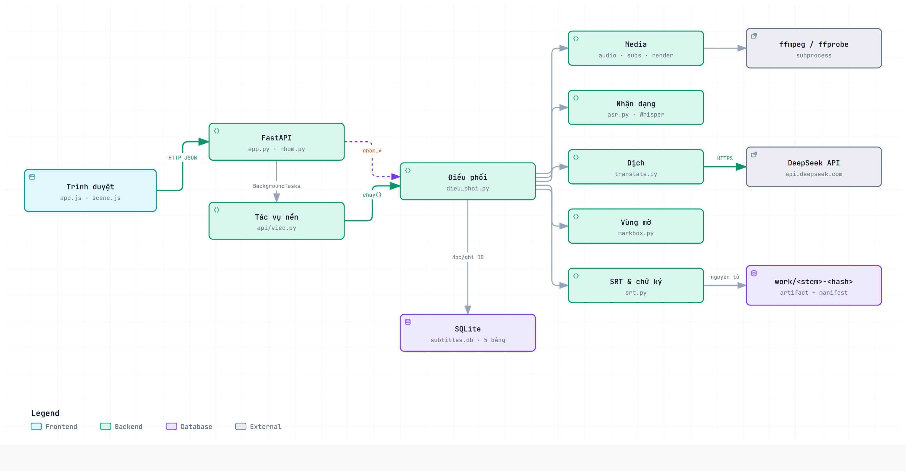
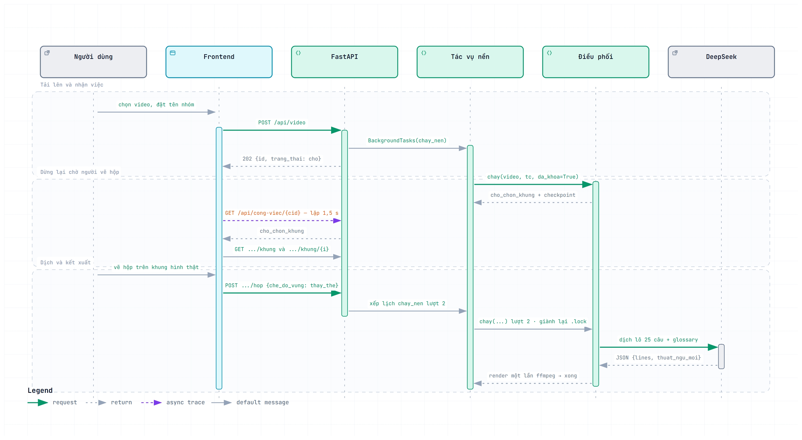

# Thiết kế hệ thống — Phần 1/3: Kiến trúc, lựa chọn kỹ thuật, API và luồng xử lý

**Đề tài:** Xây dựng hệ thống web tự động dịch và chèn phụ đề tiếng Việt cho video tiếng Anh, có xử lý che phụ đề cứng

**Nhóm:** 4 thành viên (TV1 nhóm trưởng) · **Tuần 3** — Thiết kế hệ thống · **Ngày lập:** 23/09/2026

**Tài liệu liên quan:** [Phần 2 — Cơ sở dữ liệu](PHAN2_CSDL.md) · [Phần 3 — Wireframe và khung dự án](PHAN3_WIREFRAME_KHUNG_DU_AN.md) · [Đặc tả yêu cầu (Tuần 2)](../DAC_TA_YEU_CAU.md) · [Thiết kế chi tiết](../superpowers/specs/2026-09-09-video-dich-phu-de-design.md)

Tài liệu thiết kế Tuần 3 chia làm ba phần theo nhóm tiêu chí chấm. Phần này bao gồm:

| Tiêu chí | Điểm |
|---|---|
| Sơ đồ kiến trúc và lựa chọn kỹ thuật được lý giải | 2 |
| Thiết kế API / luồng xử lý chính rõ ràng | 2 |

Mọi sơ đồ và bảng được đối chiếu với mã nguồn trong kho tại ngày lập, không phải với bản dự kiến.

---

## Mục lục

1. Kiến trúc phần mềm và lựa chọn kỹ thuật
2. Thiết kế API và luồng xử lý
3. Phụ lục

---

## 1. Kiến trúc phần mềm và lựa chọn kỹ thuật

### 1.1 Sơ đồ kiến trúc

*Hình 1 — Kiến trúc tổng thể.* Bản tương tác: [kientruc.html](../kientruc.html).

Hệ thống là một **ứng dụng web chạy cục bộ**: trình duyệt và máy chủ nằm trên cùng một máy, video không rời khỏi máy người dùng. Chỉ văn bản phụ đề được gửi đi, tới dịch vụ dịch DeepSeek.

### 1.2 Mô hình kiến trúc: phân lớp, ánh xạ sang MVC

Nhóm chọn **kiến trúc phân lớp bốn tầng** với một luật duy nhất: **phụ thuộc chỉ đi một chiều từ trên xuống**. Tầng dưới không biết tầng trên tồn tại.

| Tầng | Thư mục | Trách nhiệm | Ánh xạ MVC |
|---|---|---|---|
| Trình bày | `web/` | Bốn màn hình, vẽ hộp trên canvas, hỏi tiến độ theo chu kỳ | **View** |
| Giao tiếp HTTP | `api/` | Nhận yêu cầu, kiểm dữ liệu vào, gọi điều phối, trả JSON. **Không** gọi ffmpeg, **không** nạp model | **Controller** |
| Điều phối | `pipeline/dieu_phoi.py` | Luồng 6 bước, quyết định chạy lại hay dùng lại, là nơi **duy nhất** được gọi CSDL | **Model** — nghiệp vụ |
| Xử lý và lưu trữ | `pipeline/*.py` · `work/` | Tách âm, nhận dạng, dịch, kiểm hình học, kết xuất; SQLite và tệp trung gian | **Model** — dịch vụ và dữ liệu |

**Vì sao không gọi là MVC thuần.** Trong MVC cổ điển, Controller chọn View để trả về, còn View được máy chủ dựng. Ở đây View là một trang tĩnh tự gọi API JSON, và Controller không biết màn hình nào đang mở. Gọi đúng tên là **phân lớp, tầng trình bày tách hẳn khỏi máy chủ**. Ánh xạ sang MVC ở bảng trên chỉ để đối chiếu với khái niệm quen thuộc.

**Vì sao chọn phân lớp.** Có ba lý do, mỗi lý do đều thấy được trong mã:

- **(1) Hai đường vào, một kết quả.** Công cụ dòng lệnh `main.py` và giao diện web cùng gọi `dieu_phoi.chay()`. Không có nhánh xử lý thứ hai nên hai đường vào không thể cho kết quả khác nhau (FR-36).
- **(2) Kiểm thử không cần máy thật.** Điều phối nạp module xử lý qua một điểm duy nhất `_nap()`. Test thay điểm đó bằng bản giả, nên chạy trọn luồng mà không cần mạng, GPU hay ffmpeg (NFR-14).
- **(3) Chia việc không giẫm chân.** Mỗi thành viên sở hữu một lĩnh vực xuyên ba tầng; ranh giới giữa các tầng cũng là ranh giới giữa các tệp.

### 1.3 Ba luật phụ thuộc được giữ bằng mã

| Luật | Nội dung | Cách kiểm |
|---|---|---|
| `api/` không chứa xử lý | Không `subprocess`, không nạp model, không ghép filtergraph trong `api/`. Kiểm video cũng đi qua `dieu_phoi.nhan_dien()` | Tìm `subprocess` trong `api/` phải rỗng |
| Module xử lý không biết CSDL và HTTP | `asr`, `audio`, `subs`, `translate`, `markbox`, `render`, `srt` không import `db`, không biết `fastapi`; nhận tham số, trả dữ liệu thuần | Tìm `import db` hoặc `fastapi` trong các tệp đó phải rỗng |
| Một bộ kiểm hình học duy nhất | `markbox.kiem_hop` / `kiem_vung` phục vụ cả CLI, thân request, JSON trên đĩa và CSDL. Giao diện kiểm thêm chỉ để báo sớm | Chỉ `main.py`, `api/app.py` và `dieu_phoi.py` gọi `markbox.kiem_hop` / `kiem_vung`; `api/nhom.py` đi qua `dieu_phoi` |

### 1.4 Mô hình quy trình phát triển: lặp theo cổng

Về quy trình, nhóm **không** dùng Waterfall thuần và cũng không dùng Scrum đầy đủ. Mô hình thực tế là **lặp tăng dần theo sáu cổng** (G0 → G5, chi tiết ở tài liệu Tuần 2 mục 6.2):

| Đặc điểm | Mượn từ | Biểu hiện trong dự án |
|---|---|---|
| Cổng chỉ mở khi cổng trước đã đóng | Waterfall | G0 "hợp đồng dữ liệu" phải xong trước vì cả bốn người đều cần lớp đọc-ghi phụ đề |
| Bốn người làm song song trong một cổng | Agile | Mỗi người một nhánh, dùng dữ liệu giả để không chờ nhau |
| Chu kỳ ngắn, sản phẩm chạy được sau mỗi cổng | Agile | G2 chạy được bằng dòng lệnh, G3 chạy được qua API, G4 chạy được trên trình duyệt |
| Duyệt chéo vòng tròn trước khi gộp | Agile | TV2 duyệt TV1 · TV3 duyệt TV2 · TV4 duyệt TV3 · TV1 duyệt TV4 |

Lý do: chia theo lịch cố định thì ba người sẽ ngồi chờ người làm lớp phụ đề. Chia theo **thứ tự phụ thuộc** thì ai đủ đầu vào là bắt đầu được ngay.

### 1.5 Lựa chọn kỹ thuật và lý giải

| Thành phần | Chọn | Lý do | Phương án đã loại và vì sao |
|---|---|---|---|
| Ngôn ngữ backend | **Python 3.12** | Thư viện nhận dạng giọng nói tốt nhất chạy trên Python; cả nhóm cùng biết | — |
| Khung web | **FastAPI + uvicorn** | Có sẵn `BackgroundTasks` cho việc chạy nền; `TestClient` cho test không cần mở cổng; tự sinh tài liệu OpenAPI | Flask: phải tự lo kiểm dữ liệu vào và tài liệu API. Django: kèm ORM và trang quản trị không dùng tới |
| Việc chạy lâu | **Tác vụ nền trong tiến trình + hỏi lại mỗi 1,5 s** | Một người dùng, một máy; trạng thái công việc lưu ở bảng `cong_viec` | Celery/Redis: thêm hai dịch vụ phải cài và chạy chỉ cho một người dùng. WebSocket: tiến độ đổi theo giây, hỏi lại theo chu kỳ là đủ |
| Cơ sở dữ liệu | **SQLite, SQL viết tay, không ORM** | Một tệp, không cần máy chủ CSDL; có sẵn trong thư viện chuẩn Python; 5 bảng thì SQL tay dễ đọc hơn lớp ánh xạ | PostgreSQL/MySQL: bắt người dùng cài thêm dịch vụ. ORM: thêm một tầng trừu tượng cho 5 bảng |
| Nhận dạng giọng nói | **faster-whisper** `large-v3` chạy cục bộ | Âm thanh không rời máy (NFR-07); tự lùi từ GPU về CPU khi thiếu CUDA | Dịch vụ nhận dạng trên đám mây: phải gửi âm thanh ra ngoài và trả tiền theo phút |
| Dịch | **DeepSeek** `deepseek-v4-flash` qua thư viện `openai` | Nhận được 5 câu ngữ cảnh và bảng thuật ngữ trong cùng một yêu cầu, trả JSON có cấu trúc, đề xuất thuật ngữ mới cho nhóm; giá thấp | Dịch máy từng câu: không nhận ngữ cảnh câu trước, không đề xuất thuật ngữ mới để tích lũy qua các tập |
| Xử lý video | **ffmpeg / ffprobe** gọi qua `subprocess` | Một lệnh `-filter_complex` làm mờ và cháy phụ đề trong **một lần nén** (NFR-04); âm thanh sao chép nguyên | MoviePy, OpenCV: đọc từng khung ra bộ nhớ rồi ghi lại, chậm và dễ nén hai lần |
| Giao diện | **HTML/CSS/JS thuần, không bước build** | Bốn màn, một người dùng; kéo kho mã về là chạy, không cần Node để dùng | React/Vue: thêm bước build và cây phụ thuộc cho bốn màn hình |
| Hiệu ứng 3D | **Three.js** đóng gói sẵn trong `web/vendor/` | Chỉ để trang trí màn tải lên; tắt được, không có WebGL vẫn dùng được (NFR-11) | Tải từ CDN: không chạy khi mất mạng |
| Kiểm thử | `assert` trần, hàm giả, `TestClient`, SQLite `:memory:`; Playwright cho giao diện | Không phụ thuộc framework, chạy dưới 60 giây | pytest: ràng buộc IC-1 của nhóm không thêm framework test |
| Môi trường | **uv** + `uv.lock` | Cài lại cho ra đúng phiên bản từng gói (NFR-15) | pip + requirements.txt: không khóa phiên bản gói gián tiếp |

---

## 2. Thiết kế API và luồng xử lý

### 2.1 Nguyên tắc thiết kế API

- **JSON qua HTTP, tài nguyên là danh từ.** Hai nhóm tài nguyên: `cong-viec` (một lần xử lý) và `nhom` (nhóm video). Tên đường dẫn viết tiếng Việt không dấu, nối bằng gạch ngang.
- **Việc lâu trả về ngay.** `POST /api/video` trả `202 Accepted` kèm mã công việc; giao diện hỏi lại trạng thái mỗi 1,5 giây. Không có yêu cầu HTTP nào phải chờ vài phút.
- **Máy chủ giữ trạng thái quan trọng.** Điểm dừng chờ vẽ hộp được lưu phía máy chủ, không bao giờ nhận từ thân yêu cầu; gửi vùng lần thứ hai cho cùng một lượt bị từ chối.
- **Tài liệu máy đọc được.** FastAPI tự sinh đặc tả OpenAPI; bản chụp lưu ở [openapi.json](../openapi.json), bản sống xem tại `/docs` khi máy chủ chạy.

### 2.2 Danh sách endpoint

| Phương thức | Đường dẫn | Vào | Ra thành công |
|---|---|---|---|
| POST | `/api/video` | `multipart`: `file`, `nhom`, `lang`, `model`, `blur`, `font_scale`, `separate`, `force_asr`, `force`… | `202 {id, trang_thai: "cho"}` |
| GET | `/api/cong-viec/{cid}` | — | `{id, trang_thai, buoc, tien_do, loi, co_ket_qua}` |
| GET | `/api/cong-viec/{cid}/khung` | — | `[{i, giay, text}]` — một phần tử cho mỗi câu thoại |
| GET | `/api/cong-viec/{cid}/khung/{i}` | — | Ảnh PNG của khung thứ `i` |
| POST | `/api/cong-viec/{cid}/hop` | `{co_blur, che_do_vung, vung, luu_nhom}` | `{id, trang_thai: "cho", vung, che_do_vung}` |
| GET | `/api/cong-viec/{cid}/ket-qua` | — | Tệp `video/mp4` |
| GET · POST | `/api/nhom` | POST: `{ten}` | Danh sách nhóm · `201 {ten}` |
| GET · POST | `/api/nhom/{ten}/thuat-ngu` | POST: `{goc, dich, khoa}` | Bảng thuật ngữ của nhóm sau khi ghi |
| GET · POST | `/api/nhom/{ten}/hop` | POST: `{x, y, w, h}` | Vùng mặc định đã kiểm |

### 2.3 Quy ước mã lỗi

| Mã | Nghĩa trong hệ thống | Ví dụ |
|---|---|---|
| 400 | Dữ liệu người dùng gửi sai; sửa đầu vào rồi gửi lại | Sai đuôi tệp, tệp rỗng, quá 4 GiB, ffprobe không đọc được, hộp vượt khung, chỉ số câu không tồn tại, `che_do_vung: null` |
| 404 | Không có tài nguyên này | Mã công việc không tồn tại, chưa có video kết quả |
| 409 | Yêu cầu đúng nhưng **sai thời điểm** so với trạng thái hiện tại | Video đang được tiến trình khác xử lý, công việc chưa tới bước chọn vùng, đã gửi vùng rồi, phụ đề gốc đã đổi so với lúc vẽ |

Thông báo lỗi viết bằng tiếng Việt và nêu việc người dùng nên làm tiếp theo (NFR-10). Một số thông báo sinh ở tầng API hiện còn viết không dấu.

### 2.4 Vòng đời một công việc

| Trạng thái | Nghĩa | Chuyển sang |
|---|---|---|
| `cho` | Đã nhận, chờ tác vụ nền chạy | `dang_chay` khi tác vụ nền bắt đầu báo tiến độ |
| `dang_chay` | Đang ở một trong các bước xử lý | `cho_chon_khung` · `xong` · `suy_giam` · `loi` |
| `cho_chon_khung` | Dừng chờ người dùng vẽ vùng mờ — **không phải lỗi** | `cho` khi `POST …/hop` hợp lệ; `loi` nếu máy chủ khởi động lại |
| `xong` | Đã xuất video đầy đủ | Kết thúc |
| `suy_giam` | Đã xuất video nhưng còn câu giữ nguyên tiếng Anh, hoặc phụ đề phủ quá ít | Kết thúc |
| `loi` | Hỏng, kèm lý do | Kết thúc; người dùng tải lại video, tệp trung gian cũ được dùng lại |

Khi máy chủ khởi động lại, mọi công việc đang `cho`, `dang_chay` hoặc `cho_chon_khung` mà không còn tiến trình theo dõi đều được chuyển sang `loi` kèm hướng dẫn, nên không có công việc nào treo mãi (FR-30).

### 2.5 Luồng xử lý chính

| Mốc | Bước | Tiến độ | Việc thực hiện |
|---|---|---|---|
| 1 | `nhan_dien` | 0 % | ffprobe đọc kích thước và thời lượng |
| 2 | `sub_goc` | 10 % | Tìm phụ đề sẵn (tệp `.srt` bên cạnh, rồi track chữ nhúng); không có thì tách âm và nhận dạng bằng Whisper |
| 3 | `vung_blur` | 40 % | Có vùng (từ lần trước, từ nhóm hoặc từ yêu cầu) thì kiểm và đi tiếp; không có thì **dừng** ở `cho_chon_khung` |
| 4 | `dich` | 50 % | Gửi DeepSeek theo lô 25 câu kèm 5 câu ngữ cảnh và bảng thuật ngữ nhóm |
| 5 | `render` | 85 → 100 % | Một lệnh ffmpeg: làm mờ vùng, cháy phụ đề Việt, sao chép nguyên âm thanh |

**Vì sao vùng mờ đứng trước bước dịch** dù bước dịch không cần nó: đây là bước duy nhất cần người. Đặt sớm thì thời gian chờ của máy và của người chồng lên nhau, và người bỏ cuộc ở màn vẽ hộp chưa tốn tiền API.

*Hình 2 — Vòng đời một công việc qua các thành phần: tải lên, dừng chờ vẽ hộp, dịch và kết xuất.* Bản tương tác: [sequence.html](../sequence.html).

---

## 3. Phụ lục

### 3.1 Danh sách hình và tệp nguồn

| Hình | Tệp ảnh | Tệp nguồn để sửa và sinh lại |
|---|---|---|
| Hình 1 — Kiến trúc | `../kientruc.png` | `../kientruc.architecture.json` (archify) |
| Hình 2 — Tuần tự | `../sequence.png` | `../sequence.sequence.json` (archify) |
