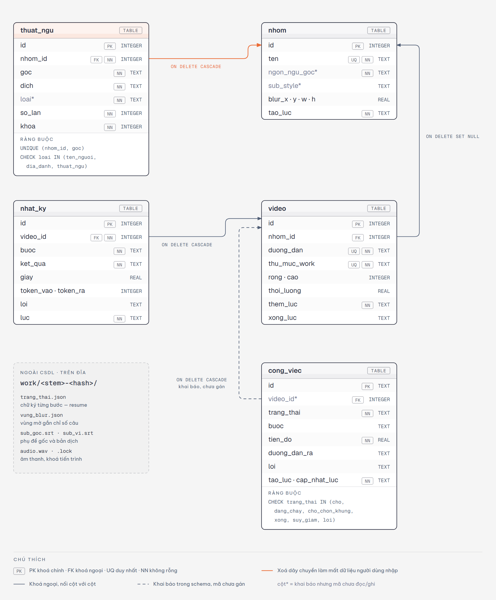

# Thiết kế hệ thống — Phần 2/3: Thiết kế cơ sở dữ liệu

**Đề tài:** Xây dựng hệ thống web tự động dịch và chèn phụ đề tiếng Việt cho video tiếng Anh, có xử lý che phụ đề cứng

**Nhóm:** 4 thành viên (TV1 nhóm trưởng) · **Tuần 3** — Thiết kế hệ thống · **Ngày lập:** 23/09/2026

**Tài liệu liên quan:** [Phần 1 — Kiến trúc và API](PHAN1_KIEN_TRUC_API.md) · [Phần 3 — Wireframe và khung dự án](PHAN3_WIREFRAME_KHUNG_DU_AN.md) · [Đặc tả yêu cầu (Tuần 2)](../DAC_TA_YEU_CAU.md) · [Thiết kế chi tiết](../superpowers/specs/2026-09-09-video-dich-phu-de-design.md)

Tài liệu thiết kế Tuần 3 chia làm ba phần theo nhóm tiêu chí chấm. Phần này bao gồm:

| Tiêu chí | Điểm |
|---|---|
| ERD / lược đồ dữ liệu đúng, chuẩn hóa, phủ hết yêu cầu | 3 |

Mọi sơ đồ và bảng được đối chiếu với mã nguồn trong kho tại ngày lập, không phải với bản dự kiến.

---

## Mục lục

1. Thiết kế cơ sở dữ liệu
2. Phụ lục

---

## 1. Thiết kế cơ sở dữ liệu

### 1.1 Dữ liệu nằm ở hai nơi, có chủ ý

| Nơi | Chứa | Mất đi thì sao |
|---|---|---|
| **SQLite** `work/subtitles.db` | Tri thức dùng lâu dài (nhóm, thuật ngữ, vùng mặc định), nhật ký từng bước, tiến độ công việc cho giao diện | Mất nhóm, thuật ngữ, nhật ký. **Không** mất video đã xử lý |
| **Hệ thống tệp** `work/<tên>-<băm>/` | Tệp trung gian của từng bước (âm thanh, phụ đề gốc, bản dịch, vùng mờ) và **manifest** `trang_thai.json` giữ chữ ký từng bước | Chỉ làm lần chạy sau phải tính lại bước đó |

**Vì sao quyết định chạy lại dựa vào tệp chứ không dựa vào CSDL.** Nếu CSDL nói "bước này xong" thì sẽ có lúc CSDL nói xong mà tệp đã bị xóa, hoặc ngược lại. Manifest luôn được ghi **sau** tệp kết quả, nên một lần sập giữa chừng chỉ gây ra việc tính lại, không bao giờ báo xong nhầm. Bảng `cong_viec` chỉ để giao diện hiển thị tiến độ, không quyết định gì.

### 1.2 Lược đồ ERD

*Hình 1 — Lược đồ CSDL vật lý: 5 bảng, kiểu cột, ràng buộc, khóa ngoại nối cột với cột và hành vi khi xóa. Khối nét đứt bên trái là phần dữ liệu nằm ngoài CSDL.* Bản HTML: [erd_day_du.html](erd_day_du.html).

Cách đọc: `PK` khóa chính, `FK` khóa ngoại, `UQ` duy nhất, `NN` không được rỗng. Đường màu cam là quan hệ duy nhất mà thao tác xóa sẽ làm mất **dữ liệu người dùng tự nhập** (bảng thuật ngữ). Đường nét đứt là quan hệ đã khai báo trong lược đồ nhưng mã chưa gán giá trị (xem mục 1.6).

### 1.3 Từ điển dữ liệu

SQLite dùng kiểu động; bảng dưới ghi đúng kiểu khai báo trong `pipeline/db.py`. Thời điểm lưu dạng chuỗi `datetime('now')` của SQLite, múi giờ UTC.

#### Bảng nhom — nhóm video (một phim, một series, một kênh)

| Cột | Kiểu | Ràng buộc | Ý nghĩa |
|---|---|---|---|
| `id` | INTEGER | PK | Khóa thay thế |
| `ten` | TEXT | NOT NULL, UNIQUE | Tên nhóm do người dùng đặt, là khóa tự nhiên |
| `ngon_ngu_goc` | TEXT | NOT NULL, mặc định `'en'` | Ngôn ngữ nguồn của nhóm — **khai báo, chưa dùng** |
| `sub_style` | TEXT | cho phép NULL | Kiểu chữ riêng của nhóm — **khai báo, chưa dùng** |
| `blur_x`, `blur_y` | REAL | cho phép NULL | Góc trên-trái vùng mờ mặc định, tỉ lệ 0–1 |
| `blur_w`, `blur_h` | REAL | cho phép NULL | Rộng, cao vùng mờ mặc định, tỉ lệ 0–1 |
| `tao_luc` | TEXT | NOT NULL, mặc định thời điểm tạo | Thời điểm tạo nhóm |

#### Bảng video — mỗi tệp nguồn đã đưa vào hệ thống

| Cột | Kiểu | Ràng buộc | Ý nghĩa |
|---|---|---|---|
| `id` | INTEGER | PK | Khóa thay thế |
| `nhom_id` | INTEGER | FK → `nhom.id`, ON DELETE SET NULL, cho phép NULL | Nhóm của video; NULL là video chạy lẻ |
| `duong_dan` | TEXT | NOT NULL, UNIQUE | Đường dẫn tệp nguồn — khóa tự nhiên |
| `thu_muc_work` | TEXT | NOT NULL, UNIQUE | Thư mục làm việc `work/<tên>-<băm đường dẫn>` |
| `rong`, `cao` | INTEGER | cho phép NULL | Kích thước khung hình, đọc bằng ffprobe |
| `thoi_luong` | REAL | cho phép NULL | Thời lượng (giây); dùng để cảnh báo khi phụ đề phủ dưới 25 % |
| `them_luc` | TEXT | NOT NULL, mặc định thời điểm thêm | Lần đầu đưa vào |
| `xong_luc` | TEXT | cho phép NULL | Lần kết xuất thành công gần nhất; bị xóa về NULL khi chạy lại |

#### Bảng thuat_ngu — bảng thuật ngữ của từng nhóm

| Cột | Kiểu | Ràng buộc | Ý nghĩa |
|---|---|---|---|
| `id` | INTEGER | PK | Khóa thay thế |
| `nhom_id` | INTEGER | FK → `nhom.id`, ON DELETE CASCADE, NOT NULL | Nhóm sở hữu thuật ngữ |
| `goc` | TEXT | NOT NULL; UNIQUE cùng `nhom_id` | Từ tiếng Anh |
| `dich` | TEXT | NOT NULL | Bản dịch đang dùng |
| `loai` | TEXT | NOT NULL, CHECK một trong `ten_nguoi`, `dia_danh`, `thuat_ngu` | Phân loại — **khai báo, mã luôn để mặc định** |
| `so_lan` | INTEGER | NOT NULL, mặc định 1 | Số lần máy gặp lại thuật ngữ này |
| `khoa` | INTEGER | NOT NULL, mặc định 0 | Người dùng đánh dấu khóa bản dịch |

#### Bảng nhat_ky — nhật ký từng bước của từng video

| Cột | Kiểu | Ràng buộc | Ý nghĩa |
|---|---|---|---|
| `id` | INTEGER | PK | Khóa thay thế |
| `video_id` | INTEGER | FK → `video.id`, ON DELETE CASCADE, NOT NULL | Video của bước |
| `buoc` | TEXT | NOT NULL | Tên bước: `sub_goc`, `vung_blur`, `dich`, `render`, `translate_apply` |
| `ket_qua` | TEXT | NOT NULL | Kết quả: `xong`, `suy_giam`, `bo_qua`, `loi` |
| `giay` | REAL | cho phép NULL | Thời gian chạy bước |
| `token_vao`, `token_ra` | INTEGER | cho phép NULL | Số token gửi và nhận từ dịch vụ dịch — cơ sở tính chi phí API |
| `loi` | TEXT | cho phép NULL | Thông báo lỗi; ở hàng `translate_apply` chứa băm tệp bản dịch (xem mục 1.5) |
| `luc` | TEXT | NOT NULL, mặc định thời điểm ghi | Thời điểm ghi |

#### Bảng cong_viec — một lần xử lý do giao diện web tạo ra

| Cột | Kiểu | Ràng buộc | Ý nghĩa |
|---|---|---|---|
| `id` | TEXT | PK | Mã công việc UUID4, là mã trong đường dẫn API |
| `video_id` | INTEGER | FK → `video.id`, ON DELETE CASCADE, cho phép NULL | Video của công việc — **khai báo, mã chưa gán** |
| `trang_thai` | TEXT | NOT NULL, CHECK một trong 6 giá trị | `cho`, `dang_chay`, `cho_chon_khung`, `xong`, `suy_giam`, `loi` |
| `buoc` | TEXT | cho phép NULL | Bước đang chạy, giao diện dùng để tô thanh bước |
| `tien_do` | REAL | NOT NULL, mặc định 0 | Tỉ lệ hoàn thành 0–1 |
| `duong_dan_ra` | TEXT | cho phép NULL | Tệp kết quả; có giá trị thì nút tải về hiện ra |
| `loi` | TEXT | cho phép NULL | Thông báo lỗi tiếng Việt cho người dùng |
| `tao_luc`, `cap_nhat_luc` | TEXT | NOT NULL | Thời điểm tạo và lần cập nhật cuối |

### 1.4 Quan hệ

| Quan hệ | Bản số | Khóa ngoại | Khi xóa bản ghi cha | Lý do chọn |
|---|---|---|---|---|
| `nhom` — `video` | 1 : 0..N; video thuộc 0..1 nhóm | `video.nhom_id` | SET NULL | Nhóm là tùy chọn. Xóa nhóm không được xóa lịch sử của video |
| `nhom` — `thuat_ngu` | 1 : 0..N | `thuat_ngu.nhom_id` | CASCADE | Thuật ngữ không có nghĩa ngoài nhóm của nó |
| `video` — `nhat_ky` | 1 : 0..N | `nhat_ky.video_id` | CASCADE | Nhật ký không có nghĩa ngoài video của nó |
| `video` — `cong_viec` | 1 : 0..N; công việc thuộc 0..1 video | `cong_viec.video_id` | CASCADE | Công việc được tạo ngay khi nhận tệp, **trước** khi tác vụ nền ghi hàng `video`, nên cho phép NULL |

Khóa ngoại được bật mỗi lần mở kết nối bằng `PRAGMA foreign_keys=ON`. Hiện hệ thống **chưa có chức năng xóa** nhóm hay video; các quy tắc khi xóa ở trên chỉ có tác dụng khi xóa tay trên CSDL.

### 1.5 Chuẩn hóa

**Dạng chuẩn 1 (1NF).** Mọi cột chứa một giá trị nguyên tử. Vùng mờ mặc định lưu thành bốn cột số `blur_x`, `blur_y`, `blur_w`, `blur_h`, không gộp thành chuỗi `"x,y,w,h"`. Không cột nào chứa danh sách: danh sách vùng mờ gắn với từng câu thoại **không** nằm trong CSDL mà nằm trong tệp `vung_blur.json` của video (lý do ở mục 1.1).

**Dạng chuẩn 2 (2NF).** Mọi bảng có khóa chính một cột, nên không thể có phụ thuộc bộ phận vào khóa chính. Riêng `thuat_ngu` còn có khóa ứng viên ghép `(nhom_id, goc)`; các cột `dich`, `loai`, `so_lan`, `khoa` phụ thuộc vào **cả** cặp đó — cùng một từ `goc` ở hai nhóm khác nhau được phép có hai bản dịch khác nhau — nên không phụ thuộc bộ phận.

**Dạng chuẩn 3 và BCNF.** Kiểm từng phụ thuộc hàm không tầm thường:

| Bảng | Phụ thuộc hàm | Vế trái có phải siêu khóa? | Kết luận |
|---|---|---|---|
| `nhom` | `id → mọi cột`; `ten → mọi cột` | Có — `ten` là khóa ứng viên (UNIQUE) | Đạt BCNF |
| `video` | `duong_dan → thu_muc_work, rong, cao, thoi_luong` | Có — `duong_dan` là khóa ứng viên | Đạt BCNF. `thu_muc_work` suy được từ `duong_dan` (băm đường dẫn) nhưng phụ thuộc vào khóa ứng viên thì không vi phạm |
| `thuat_ngu` | `(nhom_id, goc) → dich, loai, so_lan, khoa` | Có — khóa ứng viên ghép | Đạt BCNF |
| `nhat_ky` | `id → mọi cột` | Có | Đạt BCNF; mỗi hàng là một sự kiện độc lập |
| `cong_viec` | `id → mọi cột` | Có | Đạt BCNF |

**Một đánh đổi đã chấp nhận.** Hàng `nhat_ky` có `buoc = 'translate_apply'` được dùng làm **dấu đã áp bảng thuật ngữ** cho một bản dịch, và cột `loi` của hàng đó chứa băm tệp bản dịch chứ không chứa lỗi. Nhờ vậy, một lần sập giữa "ghi tệp" và "ghi CSDL" được hoàn tất ở lần chạy sau mà không đếm thuật ngữ hai lần (FR-15). Cái giá: cột `loi` mang hai nghĩa tùy giá trị `buoc`. Nhóm giữ cách này thay vì thêm một bảng chỉ để chứa một cờ.

### 1.6 Những gì lược đồ khai báo nhưng mã chưa dùng

Kiểm trên mã nguồn và trên CSDL thật `work/subtitles.db` ngày 23/09/2026:

| Thành phần | Hiện trạng | Bằng chứng trên dữ liệu thật |
|---|---|---|
| `nhom.ngon_ngu_goc` | Không có dòng mã nào đọc hay ghi; luôn là mặc định | 2/2 nhóm có giá trị `'en'` |
| `nhom.sub_style` | Không có dòng mã nào đọc hay ghi | 0/2 nhóm có giá trị |
| `thuat_ngu.loai` | Không có dòng mã nào ghi; luôn là mặc định | 11/11 thuật ngữ là `thuat_ngu` |
| `cong_viec.video_id` | `tao_cong_viec` được gọi không kèm `video_id`, không nơi nào cập nhật sau đó | 0/3 công việc có giá trị |
| `thuat_ngu.khoa`, `thuat_ngu.so_lan` | Được **ghi** nhưng chưa có nhánh nào **đọc**. Máy dịch vốn không bao giờ ghi đè bản dịch đã có, khóa hay không | — |

Những điểm trên không làm sai chức năng hiện có, vì vậy nhóm **ghi nhận và chưa sửa** trong tuần này. Hướng xử lý cần cả nhóm thống nhất: hoặc dùng (ví dụ gán `cong_viec.video_id` để truy vết một công việc về video của nó), hoặc bỏ khỏi lược đồ để người đọc sau không hiểu nhầm.

### 1.7 Ma trận phủ yêu cầu

| Yêu cầu | Dữ liệu cần lưu | Nơi lưu |
|---|---|---|
| FR-12 — tạo và chọn nhóm | Tên nhóm | `nhom.ten` |
| FR-13 — thuật ngữ học được dùng cho tập sau | Cặp từ gốc → bản dịch theo nhóm | `thuat_ngu.goc`, `thuat_ngu.dich` |
| FR-14 — sửa và khóa thuật ngữ | Bản dịch người dùng sửa, cờ khóa | `thuat_ngu.dich`, `thuat_ngu.khoa` |
| FR-15 — không đếm trùng khi chạy lại | Dấu đã áp theo băm bản dịch | `nhat_ky` hàng `translate_apply` |
| FR-21 — vùng mờ mặc định của nhóm | Một vùng chính, tỉ lệ 0–1 | `nhom.blur_x/y/w/h` |
| FR-17, FR-18 — vùng mờ chung và riêng từng câu | Danh sách vùng kèm chỉ số câu, chế độ vùng | Tệp `vung_blur.json` |
| Tra cứu video đã xử lý | Kích thước, thời lượng, lần xong gần nhất | `video.rong`, `cao`, `thoi_luong`, `xong_luc` — chỉ để tra cứu; các bước xử lý (FR-07, FR-25) đọc lại trực tiếp bằng ffprobe |
| FR-27, FR-28, FR-30 — chạy nền, tiến độ, ghi mọi kết cục | Trạng thái, bước, tỉ lệ, lỗi | `cong_viec.trang_thai`, `buoc`, `tien_do`, `loi` |
| FR-31 — tải video kết quả | Đường dẫn tệp kết quả | `cong_viec.duong_dan_ra` |
| FR-29 — chặn xử lý song song trên một video | Khóa tiến trình | Tệp `.lock` trong thư mục làm việc |
| FR-32 → FR-35 — chạy lại an toàn | Chữ ký từng bước, băm nội dung | Tệp `trang_thai.json` |
| Báo cáo chi phí API | Số token từng lần dịch | `nhat_ky.token_vao`, `token_ra` |

Lược đồ đầy đủ dạng SQL có trong [schema.sql](../schema.sql). Tệp này sinh ra từ hằng `SCHEMA` trong `pipeline/db.py`; ứng dụng tự chạy `SCHEMA` mỗi lần mở kết nối nên không cần chạy tay tệp này.

---

## 2. Phụ lục

### 2.1 Danh sách hình và tệp nguồn

| Hình | Tệp ảnh | Tệp nguồn để sửa và sinh lại |
|---|---|---|
| Hình 1 — Lược đồ CSDL | `erd_day_du.png` | `erd_day_du.html` |

### 2.2 Việc còn mở sau Tuần 3

| Việc | Vì sao | Ai quyết |
|---|---|---|
| Dùng hay bỏ các cột ở mục 1.6 | Cột khai báo mà không dùng khiến người đọc lược đồ hiểu nhầm | Cả nhóm; TV1 phụ trách CSDL |
| Gán `cong_viec.video_id` | Hiện không truy được một công việc về hàng `video` của nó qua CSDL | TV1 |
| Ý nghĩa của ô "Khóa bản dịch" | Máy vốn không ghi đè bản dịch đã có, nên cờ khóa chưa đổi hành vi nào | TV3 phụ trách dịch và thuật ngữ |
