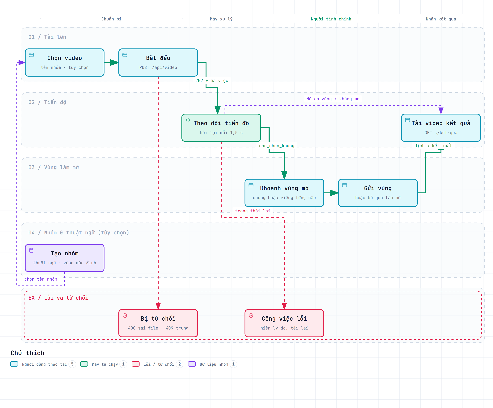
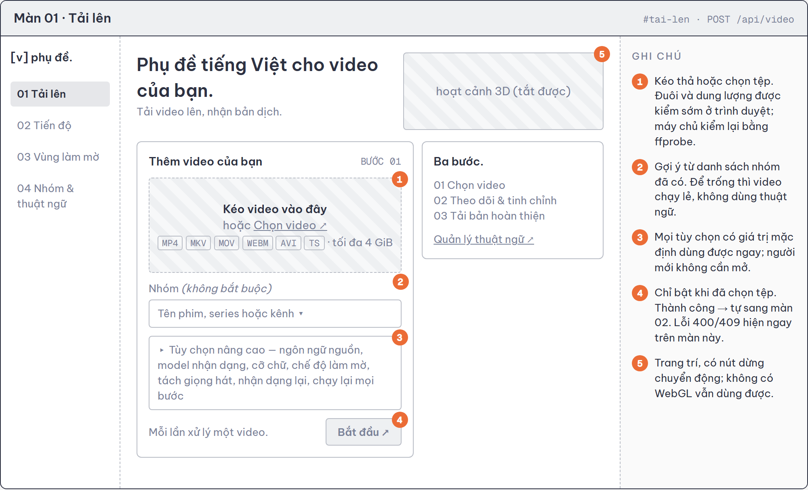
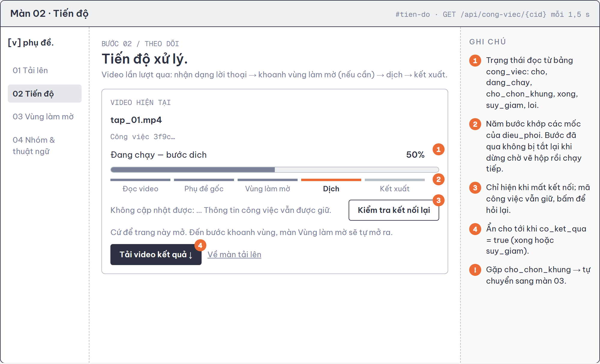
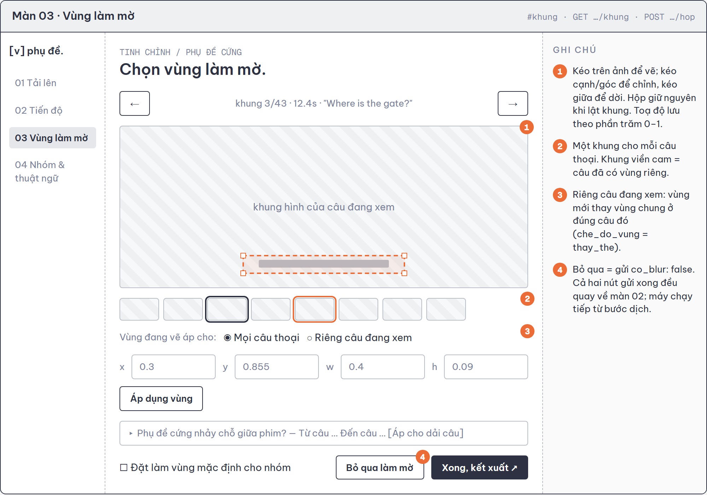
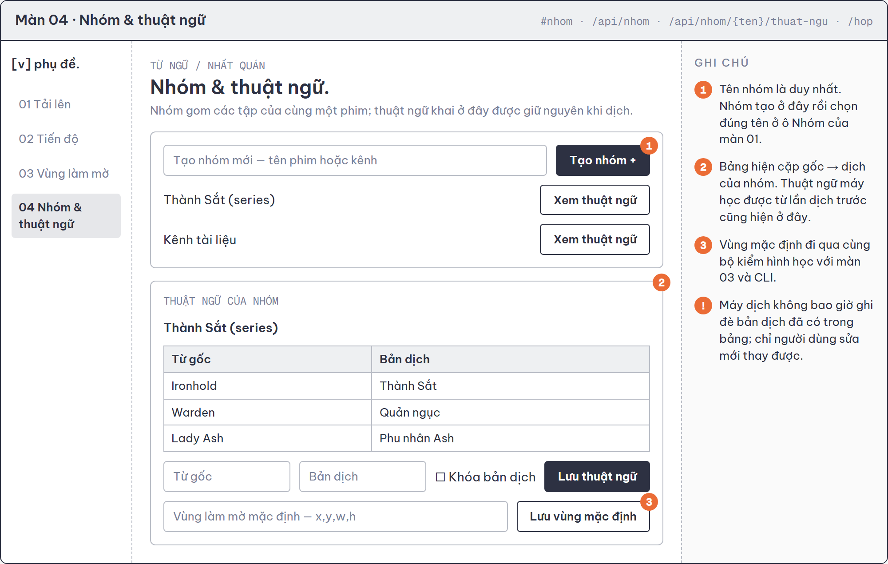
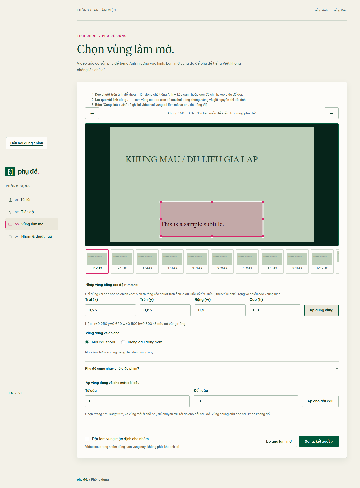

# Thiết kế hệ thống — Phần 3/3: Wireframe, luồng người dùng và khung dự án

**Đề tài:** Xây dựng hệ thống web tự động dịch và chèn phụ đề tiếng Việt cho video tiếng Anh, có xử lý che phụ đề cứng

**Nhóm:** 4 thành viên (TV1 nhóm trưởng) · **Tuần 3** — Thiết kế hệ thống · **Ngày lập:** 23/09/2026

**Tài liệu liên quan:** [Phần 1 — Kiến trúc và API](PHAN1_KIEN_TRUC_API.md) · [Phần 2 — Cơ sở dữ liệu](PHAN2_CSDL.md) · [Đặc tả yêu cầu (Tuần 2)](../DAC_TA_YEU_CAU.md) · [Thiết kế chi tiết](../superpowers/specs/2026-09-09-video-dich-phu-de-design.md)

Tài liệu thiết kế Tuần 3 chia làm ba phần theo nhóm tiêu chí chấm. Phần này bao gồm:

| Tiêu chí | Điểm |
|---|---|
| Wireframe các màn hình chính, luồng người dùng hợp lý | 2 |
| Khung dự án chạy được, cấu trúc thư mục mạch lạc | 1 |

Mọi sơ đồ và bảng được đối chiếu với mã nguồn trong kho tại ngày lập, không phải với bản dự kiến.

---

## Mục lục

1. Wireframe và luồng người dùng
2. Khung dự án
3. Phụ lục

---

## 1. Wireframe và luồng người dùng

### 1.1 Luồng người dùng

*Hình 1 — Luồng người dùng qua bốn màn.* Bản tương tác: [luongnguoidung.html](luongnguoidung.html).

**Đường chính** (màu xanh): Chọn video → Bắt đầu → Theo dõi tiến độ → Khoanh vùng mờ → Gửi vùng → Tải video kết quả. Người dùng chỉ phải thao tác ở **hai** chỗ: lúc tải lên và lúc khoanh vùng. Mọi chỗ còn lại màn hình tự chuyển.

**Nhánh phụ** (nét đứt tím):

- **Không cần vẽ.** Nhóm đã có vùng mặc định, lần trước đã vẽ cho video này, hoặc video không cần làm mờ: công việc đi thẳng từ Tiến độ tới Tải kết quả.
- **Chuẩn bị nhóm trước.** Người làm nhiều tập của cùng một phim vào màn Nhóm để tạo nhóm và khai thuật ngữ, rồi chọn đúng tên nhóm đó ở màn Tải lên.

**Nhánh lỗi** (nét đứt đỏ): tệp sai bị từ chối ngay ở màn Tải lên (400, 409), không tạo công việc; công việc hỏng giữa chừng hiện lý do trên màn Tiến độ.

**Vì sao luồng này hợp lý.** Máy chỉ dừng chờ người **đúng một lần**, và lần dừng đó đặt **trước** bước tốn tiền. Người dùng không phải quay lại màn nào để "bấm tiếp": mã công việc được giữ khi mất kết nối, và màn hình tự chuyển theo trạng thái.

### 1.2 Nguyên tắc chung của giao diện

- **Một trang, bốn màn.** `web/index.html` có bốn `<section>` ẩn hiện theo dấu `#` trên địa chỉ; thanh bên trái luôn hiện để người dùng biết mình đang ở đâu. Không tải lại trang khi chuyển màn.
- **Màn tự chuyển theo trạng thái.** Tải lên xong → Tiến độ; gặp `cho_chon_khung` → Vùng làm mờ; gửi vùng xong → Tiến độ.
- **Nhiều khổ màn hình.** Màn Tải lên đã chụp ở 360, 768 và 1440 px; ba màn còn lại chụp ở 1440 px (ảnh `B-*.png` trong `docs/ketqua/`, sinh bởi `test/frontend.cjs`).
- **Tiếp cận.** Trạng thái đọc được bằng trình đọc màn hình (`aria-live`), thanh tiến độ có `role="progressbar"`, vẽ hộp có đường thay thế bằng nhập tọa độ, tôn trọng thiết lập giảm chuyển động.

### 1.3 Màn 01 — Tải lên

*Hình 2 — Phục vụ UC-01, FR-01 → FR-03, FR-12.* Màn đầu tiên chỉ đòi **một** thao tác bắt buộc là chọn tệp; nhóm và tùy chọn nâng cao đều có mặc định. Nút Bắt đầu tắt cho tới khi có tệp, nên không có yêu cầu rỗng nào tới máy chủ.

### 1.4 Màn 02 — Tiến độ

*Hình 3 — Phục vụ UC-02, UC-06, FR-27, FR-28, FR-31.* Thanh năm bước khớp đúng năm mốc ở Phần 1, mục 2.5, nên người dùng thấy máy đang làm gì chứ không chỉ thấy một con số phần trăm. Nút tải về chỉ hiện khi có kết quả.

### 1.5 Màn 03 — Vùng làm mờ

*Hình 4 — Phục vụ UC-03, UC-04, UC-05, UC-09, FR-16 → FR-21.* Đây là màn khó nhất vì là chỗ duy nhất người dùng làm việc thật. Có **một khung hình cho mỗi câu thoại** để người dùng lật tìm câu phụ đề cao nhất; hộp vẽ giữ nguyên khi lật khung. Phụ đề cứng nhảy chỗ giữa phim thì chọn "Riêng câu đang xem" hoặc áp cho một dải câu.

### 1.6 Màn 04 — Nhóm và thuật ngữ

*Hình 5 — Phục vụ UC-07, UC-08, UC-09, FR-12 → FR-14, FR-21.* Bảng thuật ngữ gồm cả từ người dùng khai và từ máy học được ở các tập trước, để người dùng sửa cách dịch một tên riêng một lần cho mọi tập sau.

### 1.7 Từ wireframe đến giao diện thật

Bốn màn đã được hiện thực theo đúng bố cục wireframe. Ảnh dưới là màn Vùng làm mờ trên trình duyệt, chạy với dữ liệu giả lập của bộ test giao diện:

*Hình 6 — Màn Vùng làm mờ thực tế, chụp bằng Playwright ở khổ 1440 px.* Bản wireframe có thể mở trực tiếp: [wireframe.html](wireframe.html).

---

## 2. Khung dự án

### 2.1 Cấu trúc thư mục

| Thư mục / tệp | Vai trò |
|---|---|
| `api/app.py` | Router `/api`: tải lên, trạng thái, khung, gửi vùng, tải kết quả; dọn công việc mồ côi khi khởi động |
| `api/viec.py` | Tác vụ nền, sổ theo dõi công việc trong bộ nhớ, kết nối CSDL cho từng yêu cầu |
| `api/nhom.py` | Router `/api/nhom`: nhóm, thuật ngữ, vùng mặc định |
| `pipeline/dieu_phoi.py` | Điều phối 6 bước, manifest, quyết định dùng lại, quản lý nhóm — lớp duy nhất gọi `db.py` |
| `pipeline/db.py` | Lược đồ 5 bảng và mọi câu truy vấn |
| `pipeline/audio.py` · `asr.py` · `subs.py` | Tách âm, nhận dạng Whisper, tìm phụ đề sẵn |
| `pipeline/translate.py` | Gọi DeepSeek theo lô, phục hồi khi phản hồi hỏng |
| `pipeline/markbox.py` | Bộ kiểm hình học duy nhất, trích khung mẫu |
| `pipeline/render.py` | Khoảng bật vùng mờ, sinh tệp ASS, lệnh ffmpeg kết xuất |
| `pipeline/srt.py` | Đọc ghi SRT, chữ ký nội dung, ghi nguyên tử, khóa tiến trình |
| `web/` | `index.html`, `app.js`, `scene.js`, `style.css`, phông chữ và Three.js đóng gói sẵn |
| `main.py` | Công cụ dòng lệnh nội bộ: một video, cả thư mục, quản lý nhóm |
| `test_pipeline.py` + `tests_*.py` | Test ngoại tuyến, mỗi thành viên một tệp, gom về một điểm chạy |
| `test/frontend.cjs` · `test/runtime_logic.py` | Test giao diện bằng Playwright; test chạy thật với uvicorn, ffmpeg, SQLite |
| `docs/` | Tài liệu, sơ đồ (kèm tệp nguồn JSON để sinh lại), ảnh kết quả |
| `work/` | Không đưa lên kho mã: CSDL, tệp tải lên, thư mục làm việc từng video |
| `pyproject.toml` · `uv.lock` | Phụ thuộc Python và phiên bản đã khóa |

Quy ước: định danh trong mã viết **tiếng Việt không dấu** (`dieu_phoi`, `thu_muc_lam_viec`, `vung_blur`); chuỗi hiển thị cho người dùng viết có dấu. Tệp test đặt tên theo người phụ trách, không theo module.

### 2.2 Kết nối cơ sở dữ liệu

- Hàm `db.mo(đường_dẫn)` mở SQLite, bật `PRAGMA foreign_keys=ON` rồi chạy `SCHEMA`. Mọi câu lệnh tạo bảng đều có `IF NOT EXISTS`, nên lần chạy đầu tự tạo CSDL, các lần sau không đổi gì.
- Tầng web mở **một kết nối cho mỗi yêu cầu** qua cơ chế `Depends` của FastAPI và đóng khi yêu cầu kết thúc; không dùng chung kết nối giữa các yêu cầu.
- Test dùng `db.mo(":memory:")`: CSDL trong bộ nhớ, tạo mới cho từng test, không chạm tệp thật.
- Ghi dữ liệu nằm trong giao dịch của bên gọi; phần áp bảng thuật ngữ dùng `BEGIN IMMEDIATE` để hai lượt không ghi chồng lên nhau.

### 2.3 Chạy dự án

- **Bước 1.** Cài môi trường: `uv sync` (cần Python 3.12, `uv` và ffmpeg 6 trở lên).
- **Bước 2.** Tạo tệp cấu hình: chép `.env.example` thành `.env`, điền `DEEPSEEK_API_KEY`. Thiếu khóa thì các bước khác vẫn chạy; chỉ bước dịch mới báo lỗi.
- **Bước 3.** Chạy máy chủ: `.venv/Scripts/python.exe -m uvicorn api.app:app --reload`, hoặc nháy đúp `start_system.bat` trên Windows.
- **Bước 4.** Mở `http://127.0.0.1:8000`.

### 2.4 Kết quả chạy thử ngày 23/09/2026

| Kiểm tra | Lệnh | Kết quả |
|---|---|---|
| Test ngoại tuyến | `test_pipeline.py` | 34/34 test đạt, không cần mạng, GPU hay ffmpeg |
| Máy chủ khởi động và đọc CSDL | uvicorn cổng 8123, gọi `GET /api/nhom` | `200`, đọc được 2 nhóm từ `work/subtitles.db` |
| Đặc tả API | `GET /openapi.json` | `200`, đủ 9 đường dẫn như bảng ở Phần 1, mục 2.2 |
| Phục vụ giao diện | `GET /` | `200`, trả trang `index.html` |

---

## 3. Phụ lục

### 3.1 Danh sách hình và tệp nguồn

| Hình | Tệp ảnh | Tệp nguồn để sửa và sinh lại |
|---|---|---|
| Hình 1 — Luồng người dùng | `luongnguoidung.png` | `luongnguoidung.workflow.json` (archify) |
| Hình 2 → 5 — Wireframe | `wireframe_0x_*.png` | `wireframe.html` |
| Hình 6 — Giao diện thật | `../ketqua/B-region.png` | `../../test/frontend.cjs` |
